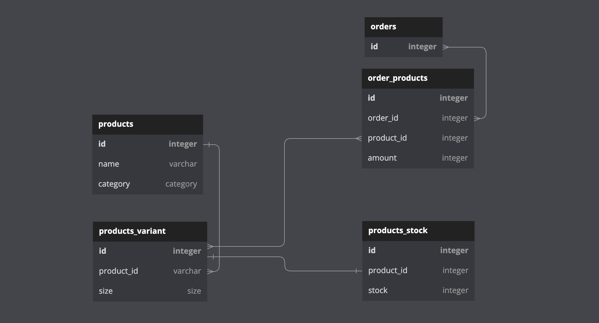

# Inditex Caso Práctico


## Índice

- [Inditex Caso Práctico](#inditex-caso-pr-ctico)
  * [Índice](#-ndice)
  * [Enunciado](#enunciado)
  * [Aviso](#aviso)
  * [DDD estratégico: Planteamiento y análisis](#ddd-estrat-gico--planteamiento-y-an-lisis)
  * [DDD táctico: implementación](#ddd-t-ctico--implementaci-n)
    + [DDD purista](#ddd-purista)
    + [Usar herencia para especificar componentes](#usar-herencia-para-especificar-componentes)
    + [ID Incrementales](#id-incrementales)
    + [Naming de los casos de uso](#naming-de-los-casos-de-uso)
    + [Un controlador por caso de uso](#un-controlador-por-caso-de-uso)
    + [Comunicación entre agregados mediante eventos](#comunicaci-n-entre-agregados-mediante-eventos)
  * [Testing](#testing)
    + [Outside in TDD](#outside-in-tdd)
  * [Simplificaciones](#simplificaciones)
- [Integración Continua](#integraci-n-continua)
- [Dockerización](#dockerizaci-n)
- [Levantar el servidor](#levantar-el-servidor)
- [Contacto](#contacto)

## Enunciado

Dado un listado de productos que se muestra en una categoría de camisetas se necesita implementar un algoritmo que permita ordenar ese listado basándonos en una serie de criterios de ordenación. Cada criterio de ordenación tendrá un peso asociado de manera que la puntuación de cada producto a ordenar vendrá dada por la suma ponderada de los criterios.

Los criterios de ordenación definidos serán el criterio de ventas por unidades y el criterio de ratio de stock, puede que a futuro se añadan nuevos criterios.

El criterio de ventas por unidades dará una puntuación a cada producto basado en el número de unidades vendidas.

El criterio de ratio de stock dará una puntuación en función de las tallas que contengan stock en ese momento.

El listado de productos es el siguiente:

| id  | name                       | sales_units | stock          |
|-----|----------------------------|-------------|----------------|
| 1   | V-NECH BASIC SHIRT         | 100         | S:4/M:9/L:0    |
| 2   | CONTRASTING FABRIC T-SHIRT | 50          | S:35/M:9/L:9   |
| 3   | RAISED PRINT T-SHIRT       | 80          | S:20/M:2/L:20  |
| 4   | PLEATED T-SHIRT            | 3           | S:25/M:30/L:10 |
| 5   | CONTRASTING LACE T-SHIRT   | 650         | S:0/M:1/L:0    |
| 6   | SLOGAN T-SHIRT             | 20          | S:9/M:2/L:5    |

La funcionalidad debe exponerse a través de un servicio REST de manera que recibirá los pesos para cada criterio.

Queda a libre elección el lenguaje y frameworks a utilizar para la implementación.

## Aviso

La prueba era sencilla, donde se pide únicamente un listado de productos implementando un ordenamiento usando el patrón criteria. Para un proyecto tan sencillo no hace falta implementar una arquitectura compleja. No obstante, se ha hecho una implementación bastante más compleja siguiendo los patrones tácticos de DDD y arquitectura hexagonal, con endpoints y funcionalidad que no se había pedido en el enunciado.

Esto ha sido para demostrar la capacidad de llevar a cabo una posible implementación de DDD+CQRS lite, ya que me gustaría que la persona que revise esto pueda analizar esas capacidades también.

A lo largo de este readme haré referencias al libro de [Implementing Doming Driven Design, de Vaughn Vernon][iddd book] en su versión de tapa dura.

## DDD estratégico: Planteamiento y análisis

Para poder abordar el problema, he analizado el enunciado para intentar extraer el [lenguaje ubicuo][ubiquitous language]. No hay demasiado que sacar aquí, pero he podido extrar el concepto de **Producto** (`product`), **Venta por unidades** (`sales units`), **stock**, **tallas** (`sizes`) y con algo menos de importancia **pesos** (`weights`) y **criterios** (`criteria`).

Una vez hecho esto, he realizado un mini workshop de [Event Storming][event storming] para explorar aún más el lenguaje ubicuo y empezar a modelar los eventos, comandos, agregados y entidades que podrían tener lugar en este proyecto ficticio. [Este es el enlace para poder ver el board en Miro][event storming workshop].


Finalmente, he pasado a limpio el workshop y me he quedado con 3 agregados para simplificar el problema:


Para no complicarlo más, he decidido tener un único core domain con un único bounded context, llamado **Store**.

Finalmente, tenemos los siguientes agregados:
* Product: Encargado de mantener la información del producto así como sus variantes (L, M y S), que son entidades. Pensándolo a posteriori esto se podría haber modelado como un ValueObject.
* Order: Contiene la información sobre una compra, que puede ser de varios productos distintos. Está compuesto de un listado de ValueObjects para cada producto y variante distinto.
* ProductVariantStock: Contiene la información de stock para cada variante.

Por último, he analizado cómo se podría implementar en una base de datos relacionar para ver la viabilidad de la implementación así como saber qué tablas con qué información podríamos tener. [En este enlace][ddbb diagram] se puede ver el diagrama.



## DDD táctico: implementación

### DDD purista

En esta prueba he decidido implementar todo de forma muy purista. Absolutamente, nada de la capa de dominio o aplicación dependen de elementos de infraestructura o elementos del framework.

Esto tiene ventajas y desventajas. La ventaja es que podemos cambiar la implementación de cualquiera de los repositorios de manera trivial y aislada. Si mañana tomamos la decisión de mover el repositorio de productos a un MongoDB, cambiar de un RabbitMQ a un SQS, se nos actualiza la librería de persistencia, o cualquier problema relacionado con terceros, solo tenemos un único punto donde tocar nuestro código. El framework no está contaminando nuestro código.

La desventaja es que esto aumenta mucho la complejidad del proyecto, ya que tenemos que serializar y deserializar los objetos cada vez que atravesamos las capas de la arquitectura hexagonal. Estas decisiones "puristas" tienen impacto, y es algo que hay que saber manejar y analizar los riesgos y costes que tenemos al acoplarnos al framework, o no.

### Usar herencia para especificar componentes

En el directorio `shared` al mismo nivel que los bounded contexts, en el directorio de dominio podemos encontrar los bloques básicos de DDD táctico. Esto tiene principalmente dos ventajas. La primera es que cuando entremos a fichero, sabemos qué componente de la arquitectura está implementado, si es un Caso de Uso[^1] o Domain Services[^2]. Además, nos permite añadir funcionalidad extra, como en el caso de los Agregados para poder emitir los eventos.

### ID Incrementales

En el enunciado los productos tienen un ID incremental. El problema con los ID incrementales, es que si los generamos por la BBDD, esta propiedad es nula en su momento de creación, lo cual puede obligarnos a gestionar los nulos. He optado por consultar el siguiente ID a la BBDD para lograr esta funcionalidad[^3].

```java
ProductId productId = productRepository.getNextId();
```

De todas maneras, en mi experiencia es más sencillo implementar los identificadores como UUID, ya que esto abre las puertas a futuro a tener una arquitectura más asíncrona y escalable como Event Sourcing.

### Naming de los casos de uso

Es una buena práctica que nuestras clases tengan un sustantivo por nombre como `ProductCreator`, pero en el caso particular de los casos de uso, en mi opinión, aporta más legibilidad que se llame como una acción, por ejemplo `CreateProduct`.

### Un controlador por caso de uso

Normalmente en Spring creamos un controlador para cada recurso REST con un método para cada operación que podamos realizar con ese recurso.

Al realizar una implementación de DDD, los controladores no tienen absolutamente nada de lógica, simplemente llaman a su caso de uso. De esta manera, cada método, idealmente, únicamente tiene una línea invocando al caso de uso correspondiente.

En mi opinión, esto no cumple con SRP[^4], y hace aumentar la complejidad de los controladores haciendo que crezcan. En esta implementación he preferido separar un controlador por caso de uso.

De esta forma, un controlador hace solo una cosa (es más fácil instanciarlo porque no tiene dependencias) y además es más fácil encontrarlo en el proyecto.

### Comunicación entre agregados mediante eventos

Los agregados representan una barrera transaccional contra el sistema de persistencia, cualquier tipo de lógica que conlleve manipular otro agregado de forma simultánea tiene que ser dirigido por eventos.

En nuestro caso del enunciado podemos ver esto principalmente para incrementar y decrementar el stock.

Tomar la decisión de realizar estas operaciones de forma asíncrona es algo importante, y que hay que consultar con los expertos de dominio. En el caso concreto del stock, creo que es algo lo suficientemente relevante para que se haga de manera transaccional. Igualmente, he decidido implementarlo en asíncrono para poder demostrar cómo se haría una implementación de este tipo.

## Testing

### Outside in TDD

Esta API la he desarrollado en su mayoría haciendo uso de esta técnica, teniendo que levantar la API en contadas ocasiones.

Outside in TDD es una metodología de desarrollo dentro de TDD que, de forma resumida, consiste en hacer un test en un elemento grande de la arquitectura, como puede ser un Test E2E, y luego para solucionarlo poco a poco hacer tests más pequeños, unitarios, a otros elementos de la arquitectura.

Esto tiene grandes beneficios a nivel de desarrollo, aquí comento unos pocos:

* Hacer TDD de esta forma consigue que tengamos un código más conciso, simple y reduce la [complejidad accidental][accidental complexity].
* Nos permite ir más rápido, ya que no tenemos que levantar la api y reproducir una serie de pasos para probar el desarrollo.
* Nos quedamos con los tests, lo cual tiene sus propios beneficios:
  * Pruebas empíricas de que el código funciona
  * Si rompemos algo, los tests nos respaldan
  * Es muy fácil reproducir bugs
  * Posibilita el despliegue continuo

Otra cosa a tener en cuenta para los tests, es la forma de realizar los tests E2E. Cuando tengo un test que requiere un setup, prefiero no hacerlo invocando directamente los repositorios o inyectando datos directamente a la BBDD. Esto podría provocar en el futuro una rotura en caso de cambiar un elemento de la infraestructura, por ejemplo migrar a un Mongo. Por el contrario, he decido hacer setup mediante la propia API, e interactuar con el sistema a modo de caja negra. Es algo más complejo y hace que los tests tarden más, pero si cumplimos con la [pirámide de testing][testing pyramid] no deberíamos tener demasiados problemas.

Por último, en algunos puntos de los tests hay datos que estan hardcodeados. Esto es intencional, para prevenir cambios accidentales en el código que puedan provocar una rutra en la API, como el nombre de un evento. Hay que tener cuidad con el [untrusted anti-pattern](https://www.youtube.com/watch?v=w60sPKEFKyE).

## Simplificaciones

Para no invertir demasiado tiempo ni volver demasiado compleja la prueba, se han realizado una serie de simplificaciones.

No existe una implementación completa de los repositorios con Hibernate, sólo se ha implementado el repositorio de Productos y probablemente es bastante mejorable.

Tampoco se ha tenido en cuenta todos los casos límites en los que se podría fallar (longitud de strings, saneamiento, control de excepciones, etc...)

No se han implementado medidas para controlar los fallos en los eventos, como acciones compensatorias o patrones como Failover.

# Integración Continua

El proyecto tiene integración continua con Github Actions. Se construye la API y se lanzan los tests.

# Dockerización

El proyecto está dockerizado con una imagen multistage, para evitar el código fuente acabe en el contenedor de producción y así aligerar la imagen.

# Levantar el servidor

Una opción es usar Docker:

```
docker compose up
```

O, directamente con Maven:

```
./mvnw spring-boot:run
```

Ojo, estoy usando elementos en preview de Java 17, por lo que es posible que tengamos que establecer la variable de entorno `JAVA_TOOL_OPTIONS=--enable-preview`.

# Contacto

* Email: danielramos@acidtango.com

[iddd book]: https://www.amazon.es/Implementing-Domain-Driven-Design-Vaughn-Vernon/dp/0321834577
[ubiquitous language]: https://othercode.es/blog/domain-driven-design-lenguaje-ubicuo
[event storming]: https://www.eventstorming.com
[event storming workshop]: https://miro.com/app/board/uXjVPMINFKw=/?share_link_id=73131942057
[ddbb diagram]: https://dbdiagram.io/d/634f1c8f47094101958df14f
[accidental complexity]: https://es.wikipedia.org/wiki/Accidental_complexity
[testing pyramid]: https://martinfowler.com/articles/practical-test-pyramid.html


[^1]: También llamados application services, capítulo 14 de IDDD.
[^2]: En pocas palabras, un servicio de domino ayuda a agregar lógica, proablemente compartida entre otros casos de uso. Capítulo 7 de IDDD.
[^3]: Esto es una recomendación dada en la página 180 del libro, en el apartado de "Persistence Mechanism Generates Identity"
[^4]: [Single Responsibility Principle](https://en.wikipedia.org/wiki/Single-responsibility_principle). 